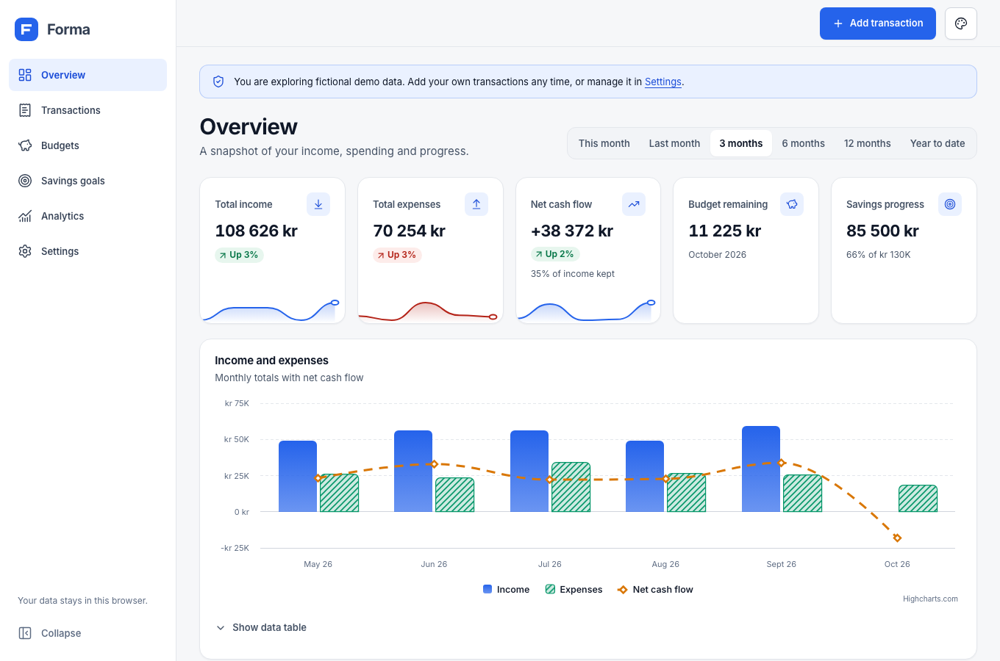
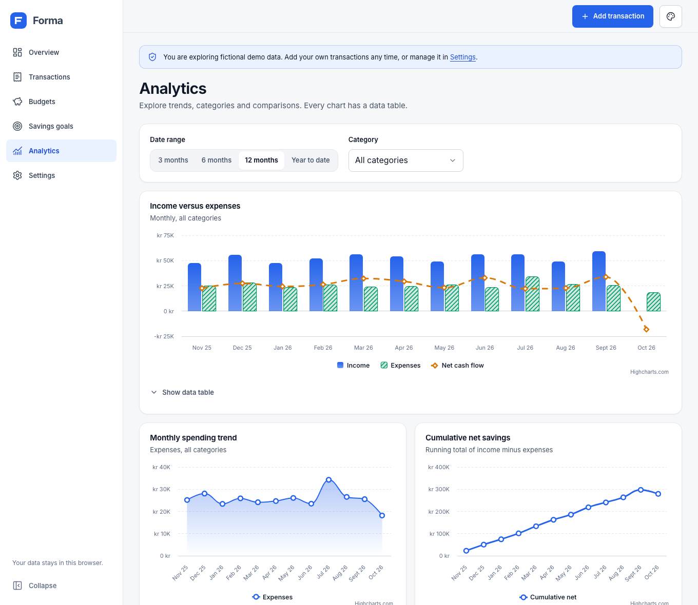
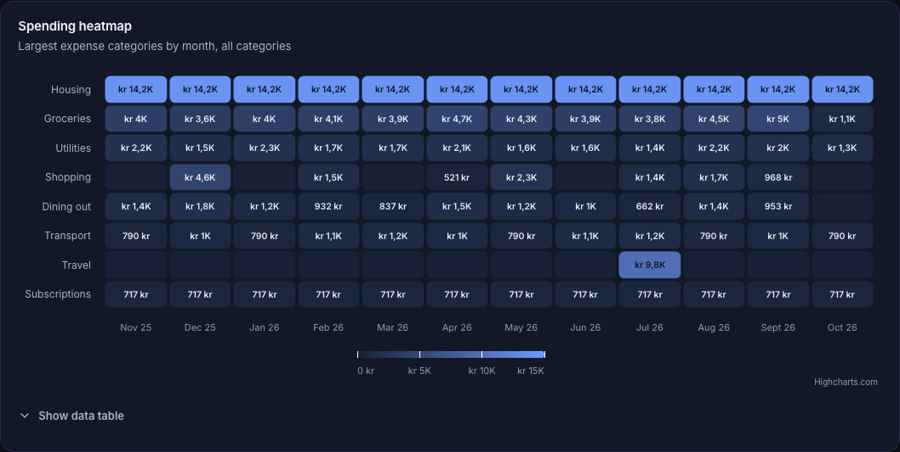
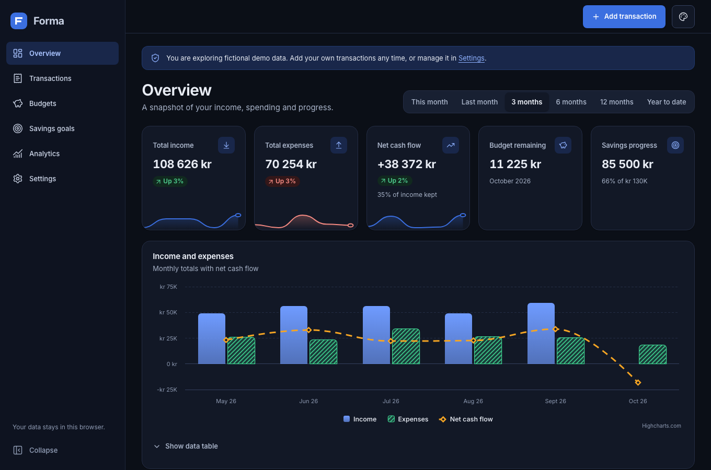
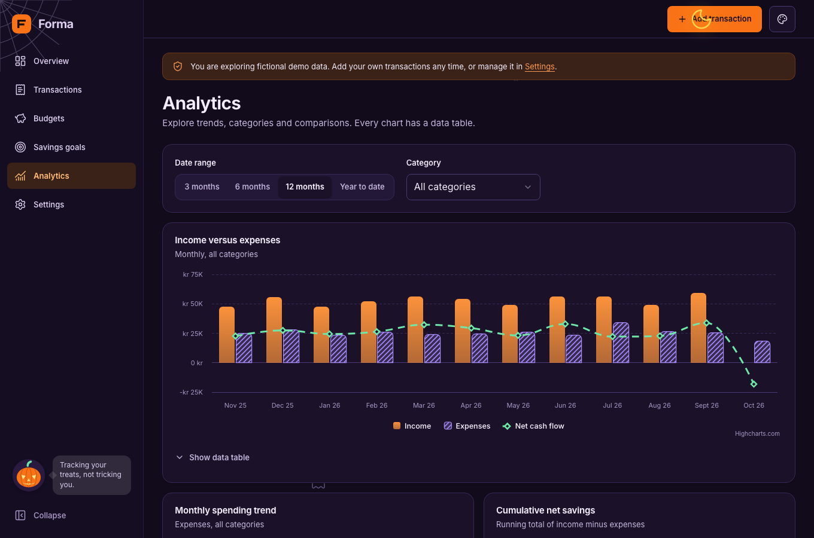
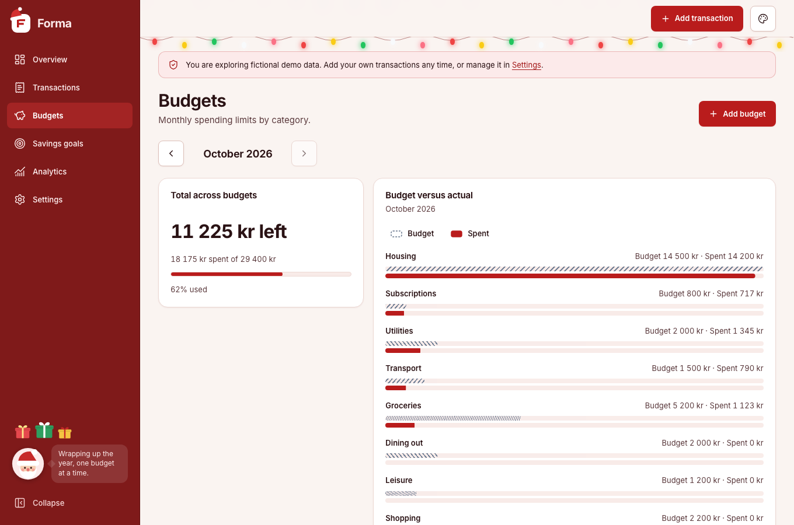
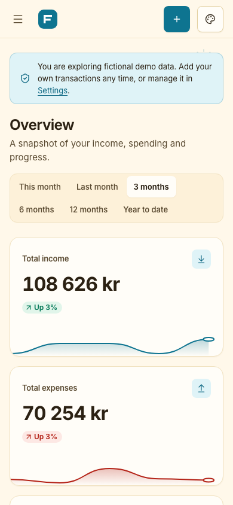

# Forma Analytics

A private, local-first personal finance dashboard: transactions, budgets, savings goals and interactive analytics. It runs entirely in your browser. There is no backend, no account and no tracking.

**Live site:** https://olebraende.github.io/forma-analytics/

Forma Analytics is an independently branded educational and portfolio project, not an operational commercial service.



| Analytics (light) | Spending heatmap (dark) |
| --- | --- |
|  |  |

| Dark | Halloween | Christmas | Mobile (Summer) |
| --- | --- | --- | --- |
|  |  |  |  |

## Features

- **Overview:** income, expenses, net cash flow, budget remaining and savings progress, with period selection, comparison against the previous period, sparkline trends in the KPI cards, trend and category charts, generated insights and recent transactions.
- **Transactions:** add, edit and delete income and expenses with validation and confirmations. Search, filter by type, category and date range, sort, and paginate.
- **Budgets:** monthly category limits, remaining amounts, utilisation, overspend and near-limit indicators, a month switcher and a budget-versus-actual chart.
- **Savings goals:** targets, saved amounts, optional dates with a required-per-month estimate, completion state and a progress chart.
- **Analytics:** income versus expenses, spending trend, cumulative savings, category breakdown, a category-by-month spending heatmap, budget versus actual, goal progress and year-over-year comparison, filterable by date range and category. Every chart has a text summary and a data table.
- **Settings:** theme, seasonal automation, motion preference, currency, locale, JSON backup and import, CSV export, demo data management and data deletion.
- **Demo mode:** realistic fictional data on first launch, clearly labelled and separate from your own records. Removing or resetting it never touches your data.

## Themes

Light (default), Dark, Summer, Christmas, Halloween and April Fools. All are semantic CSS-token themes that share tokens with the charts.

- **Automatic** follows your system light/dark setting and, if enabled, switches to a seasonal theme on its dates: Summer 1 Jun to 31 Aug, Halloween 24 to 31 Oct, Christmas 1 to 26 Dec and April Fools on 1 Apr. A manually chosen theme always wins.
- The theme is applied by a small inline script before first paint, so there is no flash of the wrong theme.
- April Fools only changes colours and playful copy. It never alters financial values.

## Tech stack

React 19, TypeScript (strict), Vite, React Router (hash routing for static hosting), CSS Modules and CSS custom properties, Lucide React, Motion for React (lazy-loaded), Highcharts (lazy-loaded, non-commercial licence), IndexedDB, Vitest, React Testing Library, Playwright with axe-core, ESLint and GitHub Actions. Font: Inter Variable, self-hosted as a Latin-subset WOFF2.

There are no backend, analytics or third-party runtime services, and no state-management library.

## Getting started

Requires Node.js 22 or newer.

```bash
npm install
npm run dev          # local development at http://localhost:5173/forma-analytics/
npm run build        # type-check and production build into dist/
npm run preview      # serve the production build
```

## Testing

```bash
npm run typecheck
npm run lint
npm test             # Vitest unit and component tests
npx playwright install chromium
npm run test:e2e     # Playwright on desktop and mobile viewports, including axe checks
```

The Playwright suite checks every route for console errors and horizontal overflow, runs axe (WCAG 2.2 AA rules) on every route in all six themes, exercises the add/reload persistence flow, theme switching, the mobile drawer, import/export, reduced motion and that no request leaves the origin.

## Architecture

```
src/
  app/        providers: preferences/theme, routing, lazy motion
  charts/     typed chart components on Highcharts, see docs/CHARTING.md
  components/ design-system primitives and shared UI
  data/       categories and demo data generator
  features/   feature-specific forms
  finance/    pure calculations, validation, and the data store
  layouts/    shell, sidebar, mobile drawer, theme menu
  routes/     one lazy-loaded page per section
  storage/    IndexedDB, preferences, import/export
  styles/     design tokens and global CSS
  themes/     theme definitions and CSS tokens
  utils/      money and date helpers
```

Presentation, state, persistence, calculations, charts and theming are kept in separate layers. Financial calculations are pure functions that do not depend on React or the chart layer.

## Local data and privacy

- Records are stored in **IndexedDB** (`forma-analytics`, schema version 1) with versioned migrations. Lightweight preferences use `localStorage`.
- Money is stored as **integer minor units** (for example øre) and parsed from text without floating-point arithmetic.
- **Nothing is sent anywhere.** The app makes no analytics or tracking requests; the e2e suite asserts that no request leaves the origin.
- IndexedDB is **not encrypted**. Anyone with access to your browser profile can read the data, so avoid using the app on shared or untrusted devices.
- Clearing site data, private browsing or switching browsers removes or hides your records. Use **Settings > Download backup** regularly.
- Imports are validated record by record, size-limited, de-duplicated against existing data, previewed before applying, and rendered as text only. CSV export neutralises spreadsheet formula injection.
- Exports carry the app name and schema version.

## Accessibility

The target is WCAG 2.2 AA. This includes semantic landmarks and headings, a skip link, keyboard-operable controls with visible focus, native `<dialog>` modals with focus management, labelled form fields with associated error messages, live-region announcements, `prefers-reduced-motion` support plus an in-app setting, and charts that never rely on colour alone (marker shapes, dash styles, stripe patterns, direct values, the Highcharts accessibility module and data tables). Automated axe checks pass on all routes in all themes. Automated checks do not replace testing with real assistive technology, which has not been done yet.

## Performance and Lighthouse

Measured with Lighthouse against the **deployed site** (https://olebraende.github.io/forma-analytics/) on 8 Oct 2026, using Chrome with Lighthouse's default throttling (mobile means simulated slow 4G and a 4x CPU slowdown). Reproduce with `npm run lighthouse`; raw results are in `reports/lighthouse-live.json`, and `reports/lighthouse.json` holds an earlier run against a local production build.

**Desktop: 100 in all four categories on every route.** These are the Overview scores, straight from the Lighthouse report:


**Mobile: 100 for Accessibility, Best Practices and SEO, but performance is below 100 on the Overview (92):**


| Route | Form factor | Performance | Accessibility | Best Practices | SEO | LCP | CLS |
| --- | --- | --- | --- | --- | --- | --- | --- |
| / (Overview) | Desktop | 100 | 100 | 100 | 100 | 0.4 s | 0 |
| /transactions | Desktop | 100 | 100 | 100 | 100 | 0.4 s | 0 |
| /budgets | Desktop | 100 | 100 | 100 | 100 | 0.4 s | 0 |
| /goals | Desktop | 100 | 100 | 100 | 100 | 0.4 s | 0 |
| /analytics | Desktop | 100 | 100 | 100 | 100 | 0.4 s | 0 |
| /settings | Desktop | 100 | 100 | 100 | 100 | 0.4 s | 0 |
| / (Overview) | Mobile | 92 | 100 | 100 | 100 | 3.0 s | 0 |
| /transactions | Mobile | 99 | 100 | 100 | 100 | 1.7 s | 0 |
| /budgets | Mobile | 99 | 100 | 100 | 100 | 1.8 s | 0 |
| /goals | Mobile | 99 | 100 | 100 | 100 | 1.8 s | 0 |
| /analytics | Mobile | 97 | 100 | 100 | 100 | 1.8 s | 0 |
| /settings | Mobile | 98 | 100 | 100 | 100 | 2.1 s | 0 |

**Why mobile performance is not 100.** On simulated slow 4G, the largest paint is limited by downloading and running the main bundle (about 94 KB gzipped, mostly React, React DOM and React Router) and then the lazy route chunk. The Overview is slowest because it also mounts the charts. Highcharts itself is a separate lazy chunk, and Motion loads after first paint. Preloading the landing route's chunks already helped; getting further would likely need a smaller router or React alternative. Scores vary from run to run.

**Running Lighthouse yourself.** Use an incognito window with extensions turned off and keep the tab in the foreground until it finishes. Chrome may warn that IndexedDB data can affect results; that only means the app has saved data in that browser, and the page still renders normally. A "NO_FCP" error means the browser tab was not painting during the run, for example because it was in the background or an extension interfered.

## Deployment

GitHub Actions (`.github/workflows/ci.yml`) type-checks, lints, runs unit and e2e tests, then builds and deploys `dist/` to GitHub Pages from `main` only after those checks pass. The Vite `base` is `/forma-analytics/` and the app uses hash routing, so refresh and direct links work on static hosting. Dependabot keeps npm packages and Actions up to date, and a workflow auto-merges its patch/minor (and all Actions) updates once the `verify` check passes. Major npm updates are left for manual review. `main` blocks force-pushes and deletion, and requires the `verify` check for merges; the repository owner can still push directly.

## Browser support

Current versions of Chrome, Edge, Firefox and Safari. The app relies on IndexedDB, native `<dialog>`, CSS `color-mix()`, container queries and `:has()`.

## Charting and licences

Charts use Highcharts, loaded lazily behind a typed abstraction. Highcharts is free only for non-commercial use under the Highsoft EULA and needs a paid licence for commercial use. This project is a personal, non-commercial portfolio and is used on that basis. See [docs/CHARTING.md](docs/CHARTING.md) for details and how to swap the chart layer.

Original project code is licensed under the [MIT License](LICENSE). It does not override the licences of third-party dependencies or assets, for example Inter (SIL Open Font License 1.1, see `public/fonts/Inter-OFL.txt`), React, Lucide, Motion and Highcharts, which keep their own licences. Highcharts is **not** covered by the MIT licence.

Copyright (c) 2026 Ole Mathias Hammer Brænde
